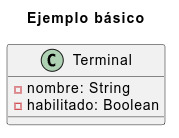
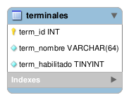

# Ejemplo básico: uso del modo REST en Patata Framework

Este ejemplo muestra cómo activar y probar el modo REST del framework.

## Pasos

### 1. Clonar el repositorio

```bash
git clone https://github.com/Ronald33/Patata-Framework
cd Patata-Framework
```

### 2. Habilitar el modo REST

Edita el archivo `config.ini` ubicado en la raíz del proyecto y activa el modo REST agregando esta línea:

```ini
ENABLE_REST = true
```
### 3. Configurar acceso libre a la API (sin autenticación)

Para fines educativos, se permitirá que cualquier IP acceda a la API sin requerir autenticación.

Para ello, edita el archivo:

```
for-custom/config.ini
```

Y agrega (o modifica) la siguiente línea:

```ini
SKIP_AUTH = /0;
```

Esto deshabilita la verificación de autenticación para todas las rutas (gracias al patrón `/0`), permitiendo probar la API desde cualquier cliente sin restricciones.

## 4. Diagrama de clases

El framework está diseñado para impulsar la **programación orientada a objetos**, por ello, el primer paso fue diseñar el diagrama de clases.



---

## 4. Modelo de base de datos

A partir del diagrama de clases se diseñó su correspondiente modelo de base de datos.  



Todo el SQL necesario —incluida la creación del esquema, la tabla `terminales` y un dato de ejemplo— está disponible en el siguiente archivo:

👉 [`db.sql`](resources/private/documentation/db/db.sql)

---

## Clase `Terminal`

Se implementó la clase `Terminal`, ubicada en la siguiente ruta:

```
back-end/model/class/Terminal.php
```

Esta clase representa la entidad del mismo nombre y está preparada para ser **serializada como JSON**, lo que permite que el API retorne directamente objetos como respuesta, por ese motivo implementa la interfaz `JsonSerializable` y se recomienda que todas las clases de modelo implementen esta interfaz.

```php
<?php
class Terminal implements JsonSerializable 
{
    private $id;
    private $nombre;
    private $habilitado;

    public function getId() { return $this->id; }
    public function setId($id) { $this->id = $id; }

    public function getNombre() { return $this->nombre; }
    public function setNombre($nombre) { $this->nombre = $nombre; }

    public function getHabilitado() { return $this->habilitado; }
    public function setHabilitado($habilitado) { $this->habilitado = $habilitado; }

    public function jsonSerialize(): array
    {
        return array_merge(get_object_vars($this), ['__class' => get_class($this)]);
    }
}
```

> ⚠️ Nota: El atributo especial `__class` permite conocer a qué clase pertenece un objeto serializado, lo cual es útil especialmente en casos de herencia.

---

## DAO de `Terminal`

La clase DAO (`Data Access Object`) correspondiente se encuentra en:

```
back-end/model/dao/TerminalDAO.php
```

Esta clase utiliza la librería `DB` provista por el framework (a través de `Repository::getDB()`), que facilita operaciones como `select`, `insert`, `update` y `delete` de forma sencilla y centralizada.

### Contenido base

```php
<?php
class TerminalDAO
{
    private static $table = 'terminales';
    private static $pk = 'term_id';

    public static function getSelectedFields($alias = NULL)
    {
        $prefix = $alias ? $alias . '.' : '';

        return [
            $prefix . 'term_id' => 'id',
            $prefix . 'term_nombre' => 'nombre',
            $prefix . 'term_habilitado' => 'habilitado'
        ];
    }

    private static function getFieldsToInsert(Terminal $terminal)
    {
        return [
            'term_nombre' => $terminal->getNombre(),
            'term_habilitado' => $terminal->getHabilitado()
        ];
    }

    private function processRow(&$row, $key, $params = [])
    {
        $row->id = (int) $row->id;
        $row->habilitado = (bool) $row->habilitado;

        if (!empty($params['cast'])) {
            $row = Helper::cast('Terminal', $row);
        }
    }

    public function selectAll($cast = true)
    {
        $results = Repository::getDB()->select(
            self::$table,
            self::getSelectedFields(),
            '',
            [],
            'ORDER BY ' . self::$pk . ' DESC'
        );
        array_walk($results, [$this, 'processRow'], ['cast' => $cast]);
        return ['data' => $results, 'total' => count($results)];
    }

    public function selectById($id, $cast = true)
    {
        $result = Repository::getDB()->selectOne(
            self::$table,
            self::getSelectedFields(),
            'term_id = :id',
            ['id' => $id]
        );
        if ($result) {
            $this->processRow($result, 0, ['cast' => $cast]);
        }
        return $result;
    }

    public function insert(Terminal $terminal)
    {
        $db = Repository::getDB();
        $db->insert(self::$table, self::getFieldsToInsert($terminal));
        $terminal->setId($db->getLastInsertId());
        return true;
    }

    public function update(Terminal $terminal)
    {
        return Repository::getDB()->update(
            self::$table,
            self::getFieldsToInsert($terminal),
            'term_id = :id',
            ['id' => $terminal->getId()]
        );
    }

    public function setHabilitado($id, $habilitado)
    {
        return Repository::getDB()->update(
            self::$table,
            ['term_habilitado' => $habilitado],
            'term_id = :id',
            ['id' => $id]
        );
    }

    public function delete($id)
    {
        return Repository::getDB()->delete(
            self::$table,
            'term_id = :id',
            ['id' => $id]
        );
    }
}
```

---

### Notas adicionales

- El método `processRow()` corrige los tipos de datos que devuelve MySQL, como convertir strings a `int` o `bool`, además, este método permitirá "enriquecer" el objeto resultante, por ejemplo, si se requiere cargar objetos relacionados como parte de la respuesta.
- El parámetro `$cast` (activado por defecto) permite convertir el resultado en una instancia de la clase `Terminal`.

> ✅ Se recomienda mantener el parámetro `$cast = true`, salvo que se requiera una respuesta en formato plano.

## Helper de Terminal

La clase `TerminalHelper` se encuentra en:

```
back-end/helper/TerminalHelper.php
```

Su función principal es centralizar **operaciones auxiliares** para la entidad `Terminal`, como casteo y configuración de validadores.

### Método: `castToTerminal`

Este método convierte un objeto genérico (como un `stdClass`) en una instancia de la clase `Terminal`, para lograrlo, utiliza el método auxiliar `Helper::cast`, el cual realiza una asignación automática de propiedades: toma las propiedades del objeto fuente (`$object`) y las copia a los atributos del objeto destino (`Terminal`), según las coicidencias en el nombre del atributo.


Además, si el parámetro `$id` no fue especificado, significa que se trata de una nueva Terminal, por lo tanto se le asigna el valor por defecto `habilitado = true`.

```php
public static function castToTerminal($object, $id = NULL)
{
    $terminal = Helper::cast('Terminal', $object);

    if ($id === NULL) // valores por defecto para nuevos registros
    {
        $terminal->setHabilitado(true);
    }

    return $terminal;
}
```

### Método: `fillValidator`

Este método se encarga de **rellenar** una instancia de la clase `Validador`, en este caso el campo que se validará será: `nombre`, el cual debe cumplir con las siguientes reglas:

- Tener mínimo 2 caracteres.
- Tener máximo 64 caracteres.
- Ser único en la tabla (ignorando el registro actual si se está actualizando, gracias a la condición opcional con `term_id != $id`).

```php
public static function fillValidator($validator, $data, $id = NULL)
{
    $validator
        ->addInputFromObject('Nombre', $data, 'nombre')
        ->addRule('minLengthIs', 2)
        ->addRule('maxLengthIs', 16)
        ->addRule(
            'isUnique',
            'terminales',
            'term_nombre',
            isset($id) ? 'term_id != ' . $id : '1'
        );
}
```

## Controlador: TerminalController

Ubicación: `back-end/controller/TerminalController.php`

Este controlador manejará las peticiones HTTP relacionadas a la entidad Terminal, se encargará de coordinar la validación, la transformación de datos y la respuesta al cliente en formato JSON.  
Su constructor inicializa las dependencias necesarias: validador, DAO (objeto de acceso a datos) y vista de respuesta.

```php
class TerminalController
{
    private $validator;
    private $dao;
    private $view;

    public function __construct()
    {
        $this->validator = Repository::getValidator();  // Obtiene un validador
        $this->dao = new TerminalDAO();                 // Instancia el DAO para Terminal
        $this->view = Repository::getResponse();        // Obtiene el manejador de respuestas HTTP
    }

    public function get($id = null)
    {
        if($id)
        {
            $result = $this->dao->selectById($id);       // Si hay ID, busca una Terminal específica
            if($result) { $this->view->j200($result); }  // Si existe, devuelve 200 con la entidad
            else { $this->view->j404(); }                // Si no existe, responde 404
        }
        else { $this->view->j200($this->dao->selectAll()); }  // Sin ID: devuelve lista completa
    }

    public function post()
    {
        $payload = Helper::getPayload();                     // Obtiene el cuerpo de la solicitud
        TerminalHelper::fillValidator($this->validator, $payload); // Añade validaciones a los inputs
        if($this->validator->hasErrors()) { $this->view->j400($this->validator->getInputsWithErrors()); }
        // Si hay errores, responde con un estado 400 incluyendo los detalles
        $terminal = TerminalHelper::castToTerminal($payload);  // Convierte el payload a Terminal
        if(!$this->dao->insert($terminal)) { $this->view->j500(); }  // Inserta a la BD, si falla responde con el estado 500
        $this->view->j201($terminal);                            // Devuelve la entidad creada
    }

    public function put($id = null)
    {
        if($id == null) { $this->view->j501(); }  // PUT requiere un ID, si no lo hay, 501

        if(!$this->dao->selectById($id)) { $this->view->j404(); } // Verifica que la entidad exista, si no, responde 404

        $payload = Helper::getPayload();
        TerminalHelper::fillValidator($this->validator, $payload, $id); // Valida con contexto de edición
        if($this->validator->hasErrors()) {
            $this->view->j400($this->validator->getInputsWithErrors()); // Si hay errores, 400
        }
        $terminal = TerminalHelper::castToTerminal($payload, $id);  // Convierte a objeto Terminal
        $terminal->setId($id);                                      // Asigna el ID que se pasó por URL (ya que Helper::cast podría haberle asignado un ID enviado por el usuario)
        if(!$this->dao->update($terminal)) { $this->view->j500(); } // Intenta actualizar o 500
        $this->view->j200($terminal);                               // Devuelve entidad actualizada con el estado 200
    }

    public function patch($id = null)
    {
        if($id == NULL) { $this->view->j501(); } // PATCH también requiere ID

        if(!$this->dao->selectById($id)) { $this->view->j404(); } // Verifica que la entidad exista antes de intentar modificarla

        $payload = Helper::getPayload();
        if($payload)
        {
            if(isset($payload->habilitado)) // Segmento para tratar el patch de habilitado
            {
                if(!in_array($payload->habilitado, [true, false], true)) { $this->view->j400(); } // habilitado solo acepta valores booleanos
                if(!$this->dao->setHabilitado($id, $payload->habilitado)) { $this->view->j500(); } // actualiza el estado del terminal, en caso de error devuelve 500
                $this->view->j200(['habilitado' => $payload->habilitado]); // Devuelve un array indicando el atributo con su nuevo valor
            }
        }

        $this->view->j501(); // Si no se especifica campo válido, responde 501 (no implementado)
    }

    public function delete($id = null)
    {
        if($id == null) { $this->view->j501(); }      // DELETE requiere un ID
        if($id == 1) { $this->view->j423(); }         // El ID 1 está protegido

        if(!$this->dao->selectById($id)) { $this->view->j404(); } // Verifica que la entidad exista antes de intentar eliminarla

        if(!$this->dao->delete($id)) { $this->view->j500(); } // Si falla al eliminar, responde 500
        $this->view->j204();                          // Si se elimina correctamente, responde 204
    }
}
```

Cada método maneja un verbo estándar de la entidad `Terminal`:
- `get`: obtiene uno o todos los recursos.  
- `post`: crea un nuevo recurso.  
- `put`: reemplaza completamente un recurso.  
- `patch`: modifica parcialmente el recurso (en este caso, solo el atributo `habilitado`).  
- `delete`: elimina un recurso, con protección especial para el ID 1.

Todas las respuestas siguen el estándar RESTful y usan códigos HTTP claros (`200`, `201`, `400`, `404`, `500`, etc.), y en caso de errores, devuelven mensajes útiles.

## 10. Cambios adicionales para que el proyecto funcione

Para que el proyecto funcione correctamente al activar el modo REST, es necesario realizar algunas configuraciones adicionales.

### a) Crear la base de datos y definir credenciales

Luego de importar el archivo [`resources/private/documentation/db/db.sql`](resources/private/documentation/db/db.sql) —que contiene el esquema, la tabla `terminales` y datos de ejemplo— se debe configurar la conexión a la base de datos, para ello edita el archivo:

```
for-custom/config.ini
```

Allí deberás definir tus propias credenciales: host, nombre de base de datos, usuario y contraseña, según tu entorno.

```ini
; *************** DB ***************
AUTO_ROLLBACK = TRUE
ENVIRONMENT = 'DEVELOPMENT'
TIME_ZONE = '-05:00'
DB_CHARSET = 'utf8'
FETCH_OBJECT = TRUE

[DEVELOPMENT]
HOST = mysql         ; o localhost, según tu entorno
USER = root          ; reemplaza por tu usuario
PASSWORD = toor      ; reemplaza por tu contraseña
DB_NAME = patata     ; reemplaza por el nombre de tu base de datos
```

---

### b) Agregar la regla `isUnique`

Para validar que el nombre de la terminal no se repita en la base de datos, se implementó una nueva regla personalizada llamada `isUnique`.

#### Archivo: `for-custom/MyRule.php`

```php
<?php
class MyRule
{
    public function getMessages()
    {
        return [
            'isUnique' => 'El valor ingresado ya se encuentra registrado',
        ];
    }

    public static function isUnique($value, $table, $column, $condition = '1')
    {
        $extras_dao = new \ExtrasDAO();
        return $extras_dao->isUnique($value, $table, $column, $condition ?? '1');
    }
}
```

---

### c) Implementar `ExtrasDAO`

Se creó una clase auxiliar llamada `ExtrasDAO` que implementa la lógica para verificar la unicidad del valor en la base de datos.

#### Archivo: `back-end/model/dao/ExtrasDAO.php`

```php
<?php
class ExtrasDAO
{
    public function isUnique($value, $table, $column, $condition = '1')
    {
        $result = Repository::getDB()->selectOne(
            $table,
            'COUNT(1) AS total',
            $column . ' = :value AND ' . $condition,
            ['value' => $value]
        );
        return (int) $result->total == 0;
    }
}
```

Esta función cuenta cuántos registros coinciden con el valor especificado y la condición adicional, y retorna `true` solo si no hay coincidencias, es decir, si el valor es único.

---

Con estos pasos adicionales completados, el proyecto estará completamente funcional para ejecutar pruebas REST con validaciones y conexión real a base de datos.